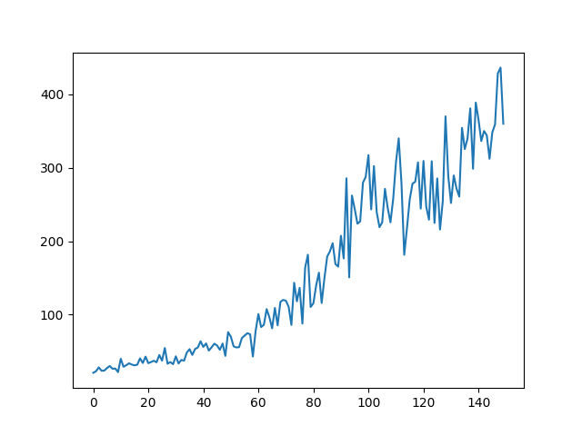

Install
```
   $ source .venv/bin/activate
   (.venv)$ pip install -r requirements.txt
```
Run learning process
```
   (.venv)$ python CarPole -n -i 150
```
Once the script finished ```best_model_weights.h5``` file is updated. The script will display a learning curve.



To show the animation using the best model the following command should be used
```
   (.venv)$ python CarPole -m1
```
